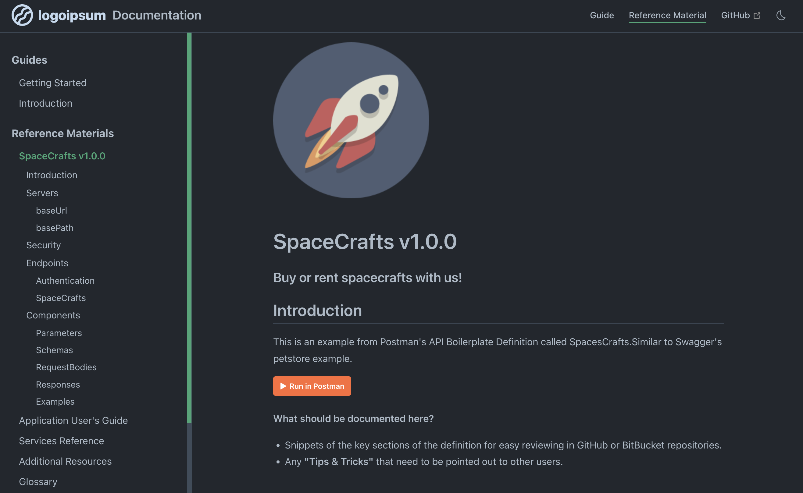

<!-- HIDDEN MARKDOWN LINKS & IMAGES -->
[Git.ico]: https://img.shields.io/badge/git-F05032?style=for-the-badge&logo=git&logoColor=white
[Git.url]: https://git-scm.com/
[Node.ico]: https://img.shields.io/badge/Node-339933?style=for-the-badge&logo=nodedotjs&logoColor=white
[Node.url]: https://nodejs.org/
[NPM.ico]: https://img.shields.io/badge/npm-CB3837?style=for-the-badge&logo=npm&logoColor=white
[NPM.url]: https://docs.npmjs.com/about-npm
[Yarn.ico]: https://img.shields.io/badge/Yarn.js-2C8EBB?style=for-the-badge&logo=yarn&logoColor=white
[Yarn.url]: https://classic.yarnpkg.com/en/docs/usage
[swagger]: https://img.shields.io/badge/swagger-85EA2D?style=for-the-badge&logo=Swagger&logoColor=black
[swagger.url]: https://swagger.io/specification/
[openapi]: https://img.shields.io/badge/openapi-6BA539?style=for-the-badge&logo=openapiinitiative&logoColor=white
[openapi.url]: https://spec.openapis.org/oas/latest.html
[postman]: https://img.shields.io/badge/postman-FF6C37?style=for-the-badge&logo=Postman&logoColor=white
[postman.url]: https://www.postman.com/
[gradle]: https://img.shields.io/badge/gradle-02303A?style=for-the-badge&logo=gradle&logoColor=white
[gradle.url]: https://gradle.org/
[maven]: https://img.shields.io/badge/maven-C71A36?style=for-the-badge&logo=apachemaven&logoColor=white
[maven.url]: https://gradle.org/

# Getting Started #

## Prerequisites

Before installing spacecrafts, a familiarity with the command line, and the following must be
installed on your computer:

[![Git][Git.ico]][Git.url]
[![Node.js][Node.ico]][Node.url]

**Your preferred Node.js package manager:**

[![npm][NPM.ico]][NPM.url]
[![Yarn][Yarn.ico]][Yarn.url]

**Your preferred OpenAPI Editor:**

[![Postman][postman]][postman.url]
[![OpenAPI 3.0.3][swagger]][swagger.url]

**Your preferred build tool:**

[![gradle][gradle]][gradle.url]
[![maven][maven]][maven.url]

# Quick Start

This section will help you get up and running quickly.

- **Step 1**: Clone for your project.

<CodeGroup>
  <CodeGroupItem title="HTTPS">

  ```bash
    git clone 'https://github.com/digitalcloud-ninja/spacecrafts.git'
    cd 'spacecrafts'
  ```

  </CodeGroupItem>
  <CodeGroupItem title="SSH">

  ```bash
    git clone 'git@github.com:digitalcloud-ninja/spacecrafts.git'
    cd 'spacecrafts'
  ```

  </CodeGroupItem>
</CodeGroup>

- **Step 2**: Run the installation.

<CodeGroup>
  <CodeGroupItem title="NPM">

  ```bash
    npm install
  ```

  </CodeGroupItem>
  <CodeGroupItem title="YARN">

  ```bash
    yarn install
  ```

  </CodeGroupItem>
</CodeGroup>


- **Step 3**: View documentation, launches Vuepress and displays documentation in your browser. 

[http://localhost:9080/spacecrafts](http://localhost:9080/spacecrafts)

<CodeGroup>
  <CodeGroupItem title="NPM">

  ```bash
    cd postman
    npm docs:run
  ```

  </CodeGroupItem>
  <CodeGroupItem title="YARN">

  ```bash
    cd postman
    yarn docs:run
  ```

  </CodeGroupItem>
</CodeGroup>

# Documentation #

<h3>Vuepress & Vue</h3>

This Developer's Kit contains a Vuepress v2 project documentation site setup inside the /postman directory. Making the
postman directory a README.md (Markdown) based documentation library. With the intent to make documenting your code
as painless as possible. It also allows for documentation to be written without checking out code, for project managers
and scrum-masters. 


