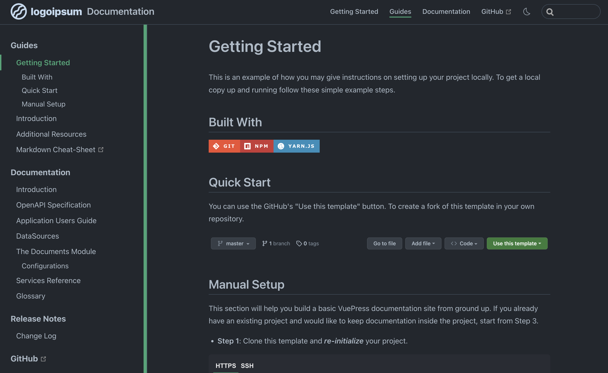

# Documenting Your Application

## Introduction



## Built With

[![Git][Git.ico]][Git.url]
[![npm][NPM.ico]][NPM.url]
[![Yarn][Yarn.ico]][Yarn.url]

## Setup Information

This section will help you build a basic VuePress documentation site from ground up. If you already have an existing
project and would like to keep documentation inside the project, start from Step 3.

- **Step 1**: Create and change into the `docs` directory

  ```bash
    mkdir {projectRoot}/docs
    cd {projectRoot}/docs
  ```

- **Step 2**: Create `package.json`

  <CodeGroup>
    <CodeGroupItem title="YARN">

    ```bash
      yarn init 
    ```

    </CodeGroupItem>
    <CodeGroupItem title="NPM">

  ```bash
    npm init
  ```

    </CodeGroupItem>
  </CodeGroup>

- **Step 3**: Install VuePress locally

  <CodeGroup>
    <CodeGroupItem title="YARN" active>

  ```bash
    yarn add -D vuepress@next @vuepress/client@next vue
  ```

    </CodeGroupItem>
    <CodeGroupItem title="NPM">
  
  ```bash
    npm install -D vuepress@next @vuepress/client@next @vuepress/plugin-search@next vue
  ```

    </CodeGroupItem>
  </CodeGroup>
  
  ::: warning
  VuePress v2 is currently in `beta` stage. It's ready to be used for building your site, but the config and API are not
  stable enough, which is likely to have breaking changes between minor releases. So make sure to read
  the [changelog](https://github.com/vuepress/vuepress-next/blob/main/CHANGELOG.md) carefully each time you upgrade a beta
  version.
  :::


- **Step 4**: Add some [scripts](https://classic.yarnpkg.com/en/docs/package-json#toc-scripts) to `package.json`

  ```json
    {
      "scripts": {
        "docs:info": "vuepress info src/main",
        "docs:dev": "vuepress dev src/main",
        "docs:build": "vuepress build src/main"
      }
    }
  ```

- **Step 5**: Add the default temp and cache directory to `.gitignore` file

  ```bash
    echo 'node_modules' >> .gitignore
    echo 'dist' >> .gitignore
    echo '.temp' >> .gitignore
    echo '.cache' >> .gitignore
  ```

- **Step 6**: Create your basic project documents

  ```bash
    mkdir -p /src/main/{guides, references/{api, application, datasources, services}, .vuepress/public/images}
    cd /src/main
  
    echo '# Introduction' >> guides/README.md
    echo '# Getting Started' >> guides/GETTING-STARTED.md
    echo '# Changelog' >> guides/CHANGELOG.md
    echo '# MIT License' >> guides/LICENSE.md
    echo '# Introduction' >> references/README.md
    echo '# Glossary' >> references/GLOSSARY.md
    echo '# API Reference' >> references/api/README.md
    echo '# Application' >> references/application/README.md
    echo '# DataSources' >> references/datasources/README.md
    echo '# Services' >> references/services/README.md
  ```

- **Step 7**: Serve the documentation site in the local server

  <CodeGroup>
    <CodeGroupItem title="YARN">
  
    ```bash
      yarn docs:dev
    ```
  
    </CodeGroupItem>
    <CodeGroupItem title="NPM">
  
    ```bash
      npm run docs:dev
    ```
  
    </CodeGroupItem>
  </CodeGroup>

VuePress will start a hot-reloading development server at [http://localhost:8080](http://localhost:8080). When you
modify your markdown files, the content in the browser will be auto updated.

By now, you should have a basic but functional VuePress documentation site. Next, learn about the basics
of [configuration](./configuration.md) in VuePress.


<!-- HIDDEN MARKDOWN LINKS & IMAGES -->
<!-- https://www.markdownguide.org/basic-syntax/#reference-style-links -->
<!-- technologies -->
[Git.ico]: https://img.shields.io/badge/git-F05032?style=for-the-badge&logo=git&logoColor=white
[Git.url]: https://git-scm.com/
[NPM.ico]: https://img.shields.io/badge/npm-CB3837?style=for-the-badge&logo=npm&logoColor=white
[NPM.url]: https://docs.npmjs.com/about-npm
[Yarn.ico]: https://img.shields.io/badge/Yarn.js-2C8EBB?style=for-the-badge&logo=yarn&logoColor=white
[Yarn.url]: https://classic.yarnpkg.com/en/docs/usage